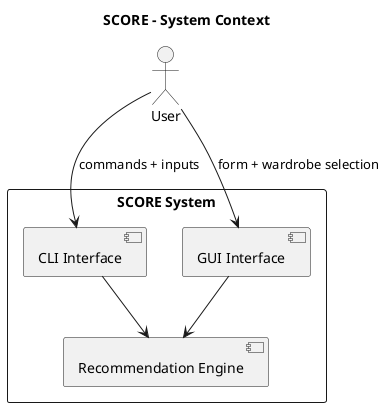
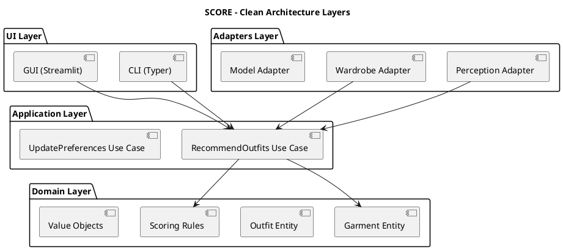
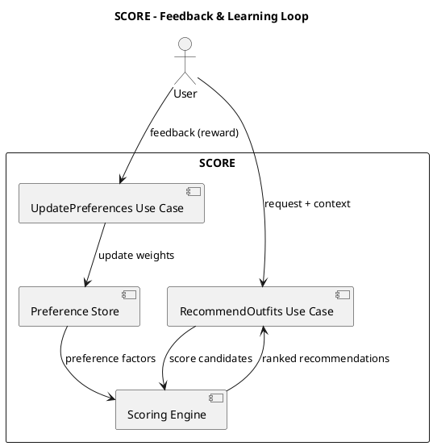

# 01 – System Architecture

## 1. Architectural Goal

SCORE is designed as a modular intelligent system that can:
- perceive clothing attributes (vision/manual inputs),
- reason under uncertainty (fuzzy scoring + contextual logic),
- adapt to user preference (reinforcement-lite feedback),
- and remain extensible for future perception upgrades (segmentation, body modeling).

The system follows **Clean Architecture + Ports/Adapters** to ensure:
- separation of concerns,
- testability,
- replaceable technology components,
- and scalable subsystem growth.

---

## 2. Architecture Style

### 2.1 Clean Architecture (Core Principle)

The codebase is organized such that:
- **Domain and use cases do not depend on frameworks or UI**.
- External systems (vision models, database, CLI/GUI) depend on the core, not the other way around.

Dependency direction:

UI / Adapters / Frameworks → Application → Domain

### 2.2 Ports and Adapters

Ports are interfaces defined in the core.
Adapters implement ports to connect external technologies.

Example:
- `WardrobeRepositoryPort` (core interface)
- `JsonWardrobeRepository` (adapter implementation)
- `SqliteWardrobeRepository` (future adapter implementation)

---

## 3. High-Level Components

SCORE is composed of:

- **Perception**: transforms input (image/manual) into garment attributes (Production-ready image inference included).
- **Wardrobe**: stores available garments and metadata.
- **Scoring Engine**: evaluates outfit compatibility using fuzzy/context rules.
- **Recommendation Use Case**: ranks outfits and returns explanations.
- **Learning Loop**: updates user preference parameters using feedback.
- **Interfaces**: CLI (Typer) and GUI (Streamlit).

---

## 4. Module / Package Layout (Multi-Module)

The repository is structured as a multi-module Python project:

- `packages/core` → domain + use cases + ports + core logic
- `packages/cli`  → CLI interface (Typer)
- `packages/gui`  → GUI interface (Streamlit)
- `Documentation/` → project documentation

Dependency constraints:

- `cli` depends on `core`
- `gui` depends on `core`
- `core` depends on nothing from `cli` or `gui`

---

## 5. Main Data Flow

Primary flow (recommendation):

1. User provides context and outfit info (manual or image)
2. Perception returns garment attributes
3. Wardrobe provides candidate garments for the context
4. Scoring engine produces compatibility scores
5. Recommendation use case ranks outcomes
6. System returns:
   - ranked outfit list
   - scores
   - explanations

---

## 6. PlantUML – System Context Diagram

---

## 7. PlantUML – Clean Architecture Layer Diagram

---

## 8. Scoring and Decision Logic (High Level)

The scoring system combines multiple signals:

- **Color compatibility**
- **Material compatibility**
- **Context suitability**
- **Style constraints (simplified for v1)**
- **User preference adjustments**

Output:

- numeric score
- explanation string (why it ranked that way)

The scoring engine is implemented as a core service used by the recommendation use case.

---

## 9. Learning Loop (Reinforcement-lite)

The learning component updates user preference weights based on feedback.

Example feedback:
- Like / Neutral / Dislike

This affects future rankings without retraining the full model.

---

## 10. PlantUML – Learning Loop Diagram

---

## 11. Perception Roadmap (Versioned)

**Version 1 (Implemented Scope)**
- Manual garment input
- Image-based garment and color detection (utilizing trained weights)
- Feature Maturity Matrix for status tracking

**Future Enhancement: Garment Segmentation**
- Perception adapter may incorporate segmentation models for:
   - garment masks
   - layered clothing identification
   - higher accuracy color extraction

**Future Enhancement: Body Shape Modeling**
- Optional extension that adds a new scoring dimension:
   - fit suitability score
   - geometry-aware recommendation logic

These are intentionally excluded from Version 1 to maintain feasibility and stability.

---

## 12. Architecture Guarantees

This architecture guarantees:
- Core logic remains framework-independent
- Perception can be swapped without breaking scoring
- Storage can be replaced (JSON → SQLite) without touching use cases
- CLI and GUI can evolve independently

---

## 13. Summary

SCORE is built as a modular intelligent system using Clean Architecture and Ports/Adapters.
This ensures the system is:
- testable
- extensible
- maintainable 
- and aligned with real-world software engineering practices.